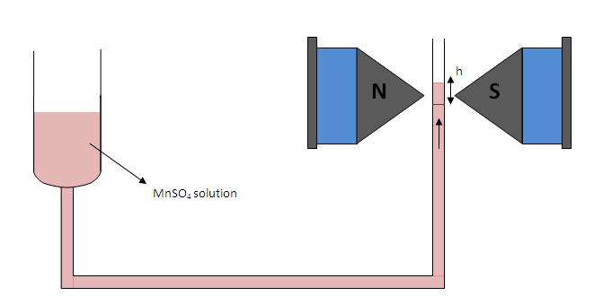

### Theory
In electromagnetism, the magnetic susceptibility $X_{m}$ is a proportionality constant which is dimensionless and indicates the degree of magnetization of a material in response to an applied magnetic field. Mathematically, we express it as

$$X_{m}=\frac{M}{H}=\mu_{r}-1..........(1)$$

Where $M$ s the magnetization, $H$ is the applied field and $\mu_{r}$ is the relative permeability of the material.

The Quincke's method is used for the determination of magnetic susceptibilities of many liquids, aqueous solutions and liquefied gases. Here we are determining the susceptibility of MnSO4 solution (which is paramagnetic) at different concentrations. The experimental set-up used for Quincke's method is shown below,

  
  
Figure 1: Arrangement for Quincke's method

Here Manganese sulphate solution under investigation is placed in a vertical U-tube with one limb of wide bore and the other with narrow bore. The narrow limb is placed in between the pole pieces of the electromagnet. It should be noted that the surface of the liquid in the narrow limb must lie at the line of centres of the pole pieces when the field is off.

When the current is switched on a strong field is appeared at upper surface of the narrow column while the lower portion will be in a state of comparatively weak field. Hence a force will act upon the column and if the liquid is paramagnetic it will rise.

We can derive an expression for the susceptibility of the liquid as given below,

$$X_{2}-X_{1}=\frac{2gh(\rho-\sigma)}{\mu_{0}H_{m}^{2}}.............(2)$$

where $X_{2}$, $X_{1}$ are the susceptibilities of the solution and air; $\rho$, $\sigma$ are the densities of  liquid and air ; $g$ the acceleration due to gravity; $h$ the rise in the surface of the liquid; and Hm is the final field applied.

Taking the susceptibility of air approximately equal to zero, (2) becomes,

$$X_{soln}=\frac{2gh(\rho-\sigma)}{\mu_{0}H_{m}^{2}}............(3)$$

